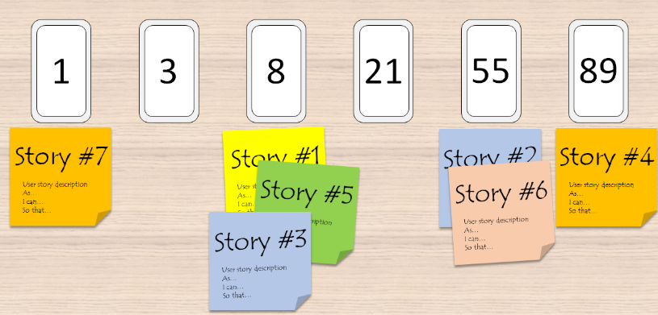

# Estimation

[Source](https://doitsmartly.ru/all-articles/management/99-agile/115-agile-estimation-techniques.html)

## Principles

- Velocity
- Teamwork
- Relative units

## Methosds

### T-Shirt sizes

Team can estimate 15-20 stories per session.

### Planning Poker

Accurate method.
Team can estimate 4-10 stories per session.

### Bucket System

Big team can estimate >50 stories per session.

### Dot-voting

Team can estimate 8-10 stories per session.

### Maximum Size or Less

Team can estimate 15-30 stories per session.

### Big/Small/Uncertain

Big team can estimate >50 stories per session.

### Ordering Rule

Accurate estimation.
Team can estimate 5-15 stories per session.

