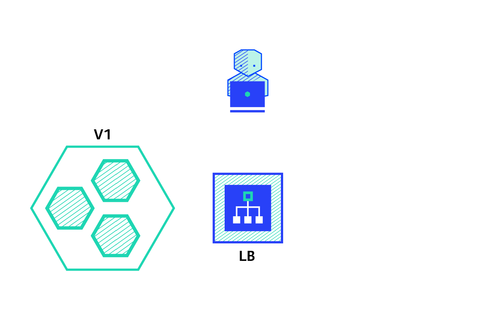
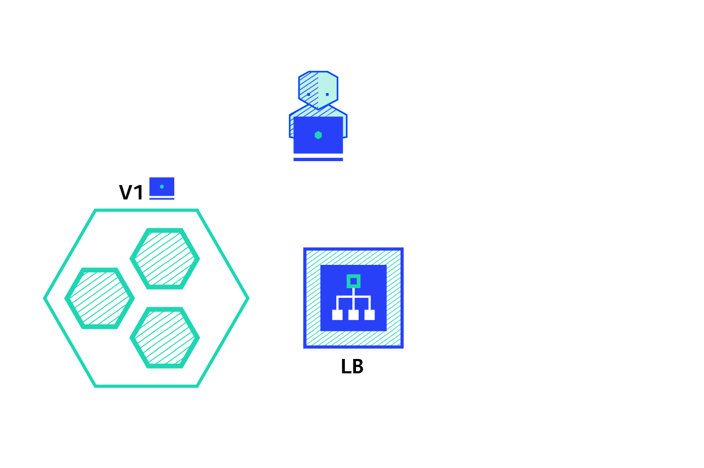

# Deployment

[Source](https://thenewstack.io/deployment-strategies/)

- **Recreate**

  Version A is terminated then version B is rolled out.
  

- **Ramped**

  (also known as rolling-update or incremental): Version B is slowly rolled out and replacing version A.
  

- **Blue/Green**

  Version B is released alongside version A, then the traffic is switched to version B.
  

- **Canary**

  Version B is released to a subset of users, then proceed to a full rollout.
  

- **A/B testing**

  Version B is released to a subset of users under specific condition.
  

- **Shadow**

  Version B receives real-world traffic alongside version A and doesn’t impact the response.
  
