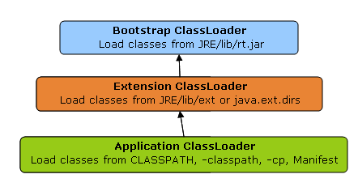
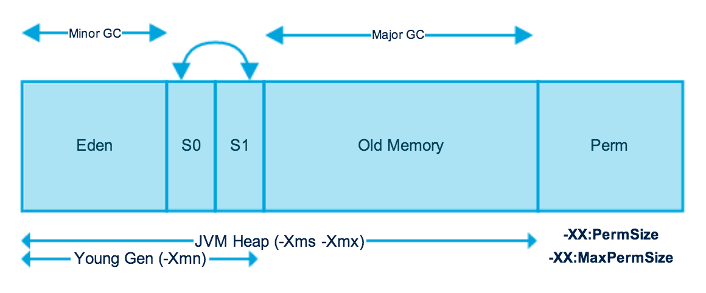
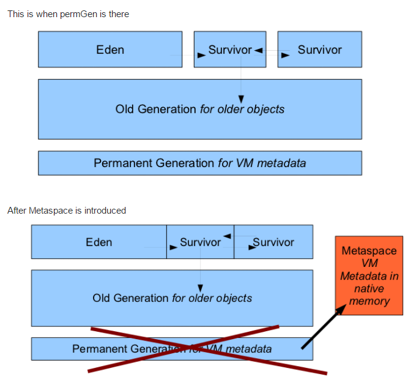

# Java

## Versions

- [9](https://www.journaldev.com/13121/java-9-features-with-examples)
- [10](https://www.journaldev.com/20395/java-10-features)
- [11](https://www.journaldev.com/24601/java-11-features)
- [12](https://www.journaldev.com/28666/java-12-features)
- [13](https://www.journaldev.com/33204/java-13-features)

## Classloaders

## Memory management

Weak, Soft Phantom: provided to assist Java Garbage Collector in a case of low memory issues.
